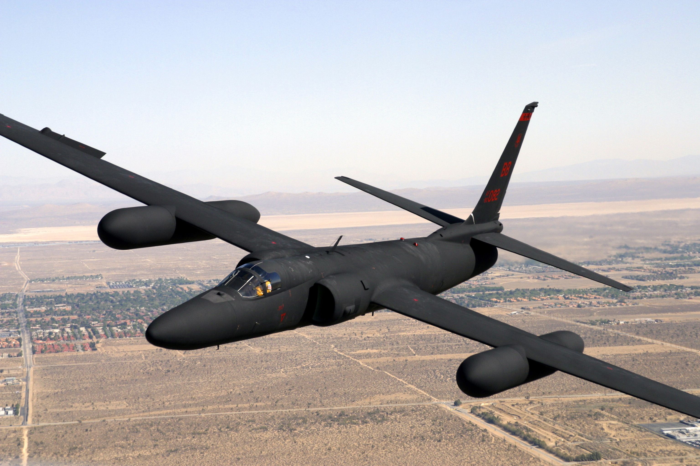
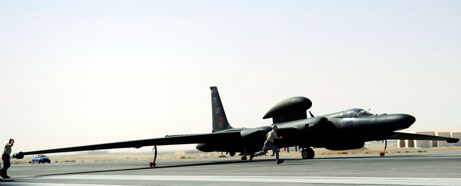
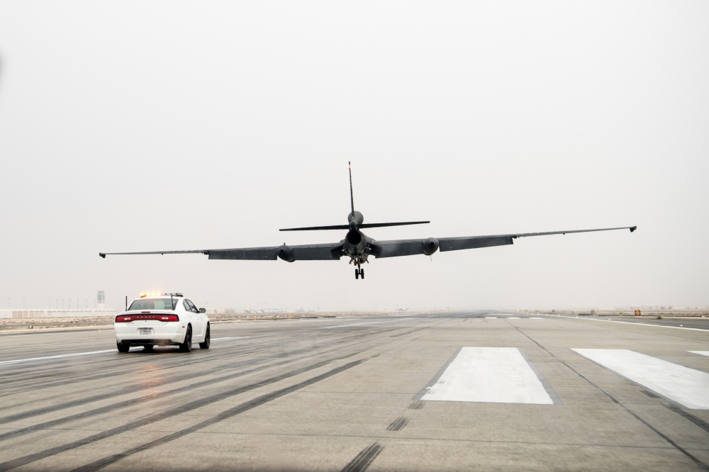

# Unikraft

**Gabe Parmer**

© Gabe Parmer, 2025, All rights reserved

---

## Specialization

Superpower: do *not* support general systems
- Lean in to customizing code to special purposes

Benefits
- Less code
- Custom abstractions & policies - no-ish semantic gap
- Less memory

---

## Specialization Example: RTOSes

Optimization: response time
- Apps can hook into ISR
- Strict priority scheduling
- Very limited disabling of preemptions
- No protection boundary crossings $\to$ no isolation!

---

---

Highly specialized
- Spy-plane
- Glider with a fighter jet engine
- 70,000 feet altitude ceiling
  - Density of air: 5.8% that at sea-level
  - Mt. Everest's peak is at 29,000 feet
  - Commercial airlines between 31,000-38,000 (31% air density)

**Spy bicycle** <!-- .element: class="fragment" data-fragment-index="2" -->

---

## Shed Weight

As lift requires air density, every pound saved in the aircraft results in a [10-foot increase in altitude ceiling](http://www.barryschiff.com/high_flight.htm)

> How can we shed weight?

Idea: landing gear is heavy
- But I guess we can't crash on landing, right?
- or CAN WE??? <!-- .element: class="fragment" data-fragment-index="2" -->

---

---

## Costs of Specialization

- Bicycle with two gravity-removed stabilizing wheels for take-off
- Landing: titanium skid plates on the end of each wing
  - need to gently let them fall
- But: we're a glider
  - to land, we have to *stall*
  - and we're landing on only two wheels

---

---

## Landing Gear Analogy

Composite: Do as much processing at *build time* as possible, and pass the results of this to the `init` equivalent
- Structure of components
- IPC channels between then
- Capability-table contents (who has access to what?)

---

## Specialization in the Cloud?

What would this look like?
- OS customized for a *single application*
- No need for horizontal isolation
  - No authentication
  - Single namespace
  - No resource multiplexing

---

## Specialization in the Cloud?

More unintuitively: no need for *vertical isolation*

Single application
- what benefit does it have from compromising the OS (:clown_face:)?

---

## [Unikernels](https://dl.acm.org/doi/10.1145/2490301.2451167)

OS as libraries, specialized to an application

- Focus on configuring the software to include only features/policies that are relevant for the application
- Unikraft, MirageOS, IncludeOS, Rumpkernels, OSv
- Composite, but without the option for isolation :smiling_face_with_horns:
